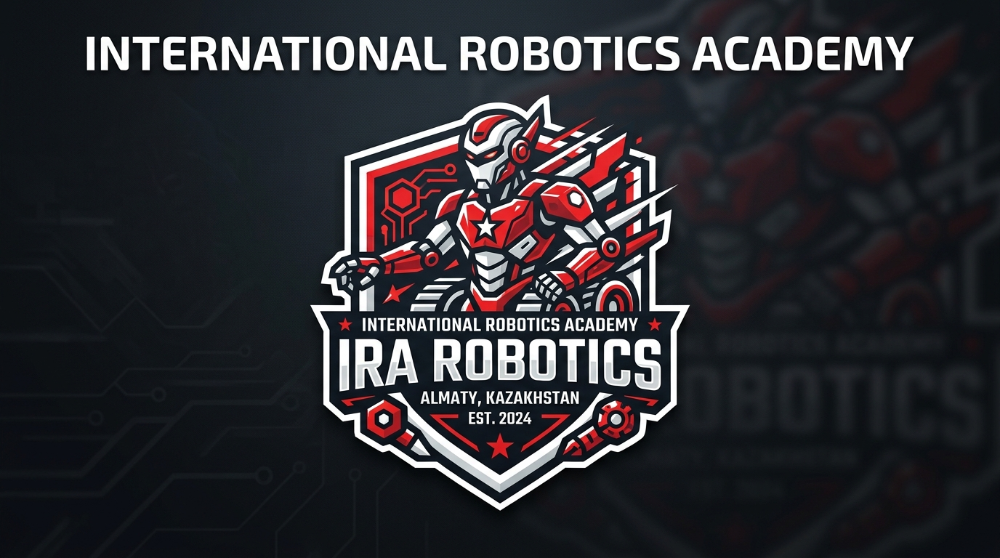
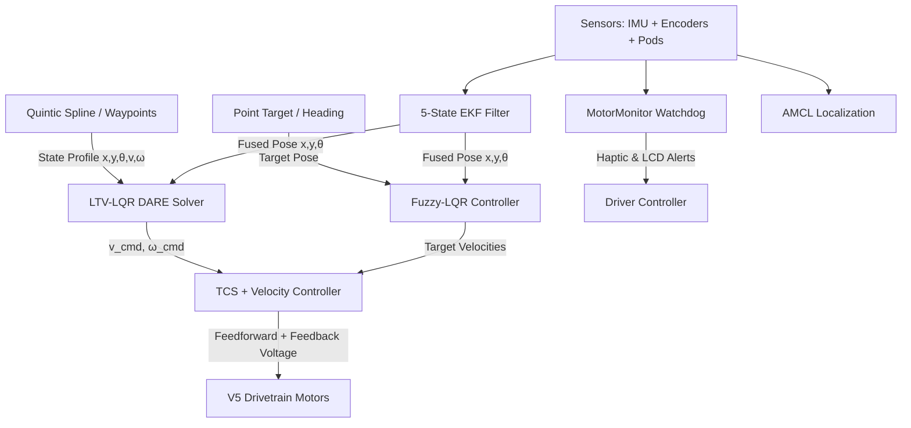

<p align="center">
  
</p>

<p align="center">
  
  
  
  
  
</p>

<hr>

# IRAlib — Next-Generation VEX V5 Control Architecture

**IRAlib** is an advanced, high-performance VEX V5 robotics control framework developed at the **International Robotics Academy (Almaty, Kazakhstan)** for competitive robotics, engineered specifically for the Kazakhstan National Championship and international VEX World Championships.

Combining modern state-space control theory, real-time optimal trajectory tracking, nonlinear state estimation, and intelligent hardware safety watchdogs, **IRAlib** represents the cutting edge of competitive mobile robotics programming.

---

## ⚡ Key Architectural Features

### 🏎️ 1. State-Space & Optimal Control
- **LTV-LQR Trajectory Tracking**: Linear Time-Varying controller executing high-speed curved paths using an **online DARE Riccati solver** (Structure-Preserving Doubling Algorithm) on ARM Cortex-A9 at 100 Hz.
- **LQR Optimal State Feedback**: Full-state feedback ($u = k_P e - k_V v - k_A a + k_I \int e$) with EMA low-pass filtering and anti-derivative kick logic.
- **TCS (Traction Control System)**: Active anti-slip module preventing tire spinout during explosive launches by throttling torque to match the maximum static friction limit.
- **Adaptive Fuzzy Logic Control (FLC)**: Takagi-Sugeno fuzzy inference system dynamically scaling $k_P$ and $k_V$ based on instantaneous position error and velocity.
- **Jerk-Limited Quintic Splines**: On-the-fly $C^2$-continuous 5th-order Hermite spline generator with strict bounds on maximum jerk ($j \le 3.5\,\text{m/s}^3$).
- **PIDf Inner-Loop Velocity Controller**: Hyperbolic tangent friction feedforward ($kS \cdot \tanh, kV, kA$) coupled with closed-loop PI velocity tracking.

### 📍 2. Localization & Sensor Fusion
- **5-State Extended Kalman Filter (EKF)**: Fuses differential drive motor encoders, spring-loaded tracking wheels, and V5 Inertial Sensor (IMU) with covariance estimation.
- **Adaptive Monte Carlo Localization (AMCL)**: 2000-particle filter utilizing distance sensor raycasting against field walls for continuous 2D relocalization.
- **Multi-Sensor Recalibration Suite (`OdomReset`)**: High-precision wall bumper, optical centerline, and 4-way trigonometric distance sensor resets.

### 🛡️ 3. Safety & Diagnostic Subsystems
- **Watchdog Health Monitor (`MotorMonitor`)**: Background diagnostic task continuously verifying Smart Port cable connections and motor temperatures ($>55^\circ\text{C}$), providing haptic rumble and LCD notifications.
- **Automated Color Sorter**: Optical sensor game piece identification and automatic opposing alliance ejection with runtime color switching.

---

## 📐 System Control Flow



---

## 📂 Codebase Structure

```
include/
├── Eigen/                     # Header-only Eigen C++ template library for linear algebra
├── lemlib/                    # LemLib core foundations (Chassis, Pose, Odometry, Math)
└── subsystems/
    ├── subsystems.hpp         # Master header for all subsystems
    ├── VelocityController.hpp # PIDf inner-loop controller with Active TCS
    ├── MotorMonitor.hpp       # Real-time motor disconnect & overtemp watchdog
    ├── ColorSorter.hpp        # Optical sensor piece sorter
    ├── OdomReset.hpp          # Wall, line, and 4-distance sensor localization
    ├── ekf/
    │   └── EKF.hpp            # 5-State Extended Kalman Filter
    ├── flc/
    │   └── FuzzyLogic.hpp     # Adaptive Fuzzy Logic Controller
    ├── trajectory/
    │   └── QuinticSpline.hpp  # Jerk-limited 5th-order spline generator
    ├── ltv/
    │   ├── State.hpp          # Trajectory waypoint definition
    │   └── ltv.hpp            # LTV-LQR DARE optimal trajectory follower
    └── mcl/
        └── MCL.hpp            # AMCL particle filter localization
src/
├── main.cpp                   # Competition entrypoint with interactive test suite
└── subsystems/
    ├── VelocityController.cpp
    ├── MotorMonitor.cpp
    ├── ColorSorter.cpp
    ├── OdomReset.cpp
    ├── ekf/EKF.cpp
    ├── flc/FuzzyLogic.cpp
    ├── trajectory/QuinticSpline.cpp
    ├── ltv/ltv.cpp
    └── mcl/MCL.cpp
docs/
└── TUNING_GUIDE.md            # Comprehensive step-by-step tuning manual
```

---

## 🛠️ Interactive Tuning Test Suite

In driver control mode (`opcontrol`), use the interactive controller buttons for live tuning:

| Button | Action | Purpose |
| :--- | :--- | :--- |
| **[ A ]** | **360° Track Width Spin** | Spin exactly 360° to calibrate effective track width. |
| **[ B ]** | **24" Linear Drive Test** | Test straight line accuracy, settle time, and $k_P/k_V$. |
| **[ Y ]** | **90° Angular Snap Test** | Test heading stiffness and overshoot damping. |
| **[ UP ]** | **LTV S-Curve Trajectory** | Run a 2-meter smooth curved path with real-time DARE solving. |
| **[ RIGHT ]** | **Quintic Spline Test** | Generate and track a $C^2$ jerk-limited 5th-order spline on-the-fly. |
| **[ DOWN ]** | **$k_S$ Characterization** | Measure the static friction voltage required to start moving. |
| **[ X ]** | **LQR $\leftrightarrow$ PID Toggle** | Switch between Optimal LQR and Classic PID on the fly. |

> 📖 **Full Tuning Manual:** See [docs/TUNING_GUIDE.md](docs/TUNING_GUIDE.md) for detailed step-by-step instructions.

---

## 🚀 Quick Start Example

```cpp
#include "main.h"
#include "lemlib/api.hpp"
#include "subsystems/subsystems.hpp"

// Drivetrain & Motors (Correct physical left/right wiring)
pros::MotorGroup leftMotors({-3, 18, -5}, pros::MotorGearset::blue);
pros::MotorGroup rightMotors({-10, 3, -17}, pros::MotorGearset::blue);

lemlib::Drivetrain drivetrain(&leftMotors, &rightMotors, 10.5, lemlib::Omniwheel::NEW_325, 450.0, 2.0);
lemlib::Chassis chassis(drivetrain, linearController, angularController, lateralLQR, angularLQR, sensors);

// Cascaded LTV + TCS Velocity Controller
VelocityControllerConfig velConfig{ 
    .kV = 6.2, 
    .KA_straight = 0.25, 
    .KS_straight = 0.45, 
    .KP_straight = 2.0,
    .enableTCS = true,
    .maxSlipRatio = 0.18
};
lemlib::LTVPathFollower ltvFollower(chassis, leftMotors, rightMotors, velConfig);

void autonomous() {
    // 1. Generate and follow a smooth Jerk-Limited Quintic Spline
    auto path = lemlib::QuinticSplineGenerator::generateTrajectory({
        .start = lemlib::Pose(0, 0, 0),
        .end = lemlib::Pose(24.0, 48.0, 45.0),
        .maxVel = 1.2,
        .maxAccel = 2.0,
        .maxJerk = 3.5
    });

    ltvFollower.followTrajectory(path, {.log = true});
    ltvFollower.waitUntilDone();

    // 2. High-precision LQR snap turn
    chassis.useLQR();
    chassis.turnToHeading(90, 1000);
    chassis.waitUntilDone();
}
```

---

## 🏛️ About International Robotics Academy

**International Robotics Academy (IRA)** is located in **Almaty, Kazakhstan**, educating the next generation of world-class roboticists and control engineers.

- 📍 **Location**: Almaty, Kazakhstan
- 🏆 **Focus**: Advanced Controls Theory, Embedded Systems, VEX V5 Competition Robotics

---

## 📄 License & Acknowledgments

- **License**: [MIT License](LICENSE)
- **Acknowledgments**: Thanks to [LemLib](https://github.com/LemLib/LemLib) and [Eigen](https://gitlab.com/libeigen/eigen) for foundational frameworks.
