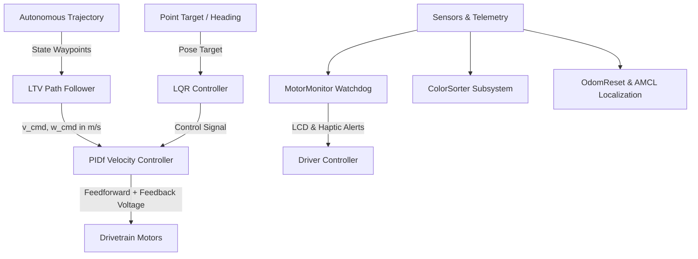

<p align="center">
  
</p>

<p align="center">
  
  
  
  
</p>

<hr>

# IRAlib

**IRAlib** is an advanced, high-performance VEX V5 robotics control framework developed at the **International Robotics Academy (Almaty, Kazakhstan)** for competitive robotics, designed for both Kazakhstan Nationals and international championship tournaments.

Inspired by the modularity of [LemLib](https://github.com/LemLib/LemLib) and the robust engineering principles of [OkapiLib](https://github.com/OkapiLib/OkapiLib), **IRAlib** introduces modern state-space control theory, optimal time-varying trajectory tracking, probabilistic localization, and intelligent hardware monitoring into a unified, competition-proven C++ library.

---

## ⚡ Key Features

### 🏎️ Advanced Motion Control
- **LTV-LQR Trajectory Tracking**: Linear Time-Varying controller executing high-speed curved paths using an **online DARE Riccati solver** (2–3 ms convergence) to compute optimal curvature-adaptive gains.
- **LQR Optimal State Feedback**: Linear Quadratic Regulator for razor-sharp point-to-point targeting and turns with instantaneous velocity and acceleration damping.
- **PIDf Inner-Loop Velocity Controller**: Voltage-level feedforward ($kS$ static friction, $kV$ velocity, $kA$ acceleration) coupled with closed-loop PID velocity tracking.
- **Multi-Controller Hybrid Architecture**: Switch between **LTV**, **LQR**, and **PID** on the fly with zero re-calibration.
- **Drive Curves & Curvature Drive**: Non-linear exponential throttle and steering curves for precise, natural driver handling.

### 📍 Localization & Sensor Fusion
- **Arc-Based Odometry**: Dual vertical & horizontal tracking wheel odometry combined with V5 Inertial Sensor heading tracking.
- **Adaptive Monte Carlo Localization (AMCL)**: High-performance 2000–5000 particle filter utilizing distance sensor raycasting against field walls for continuous 2D position correction.
- **Multi-Sensor Recalibration Suite (`OdomReset`)**:
  - **4-Way Distance Sensor Triangulation**: Global position reset using cardinal distance sensor measurements.
  - **Optical Centerline Reset**: Automatically zeroes coordinate axes when crossing white field tape.
  - **Wall Bumper Reset**: Instant physical perimeter recalibration.

### 🛡️ Autonomy & Game Automation
- **Automated Color Sorter**: Optical sensor game piece identification and automatic opposing alliance ejection via roller/intake control, with instant runtime team color switching.
- **Watchdog Health Monitor (`MotorMonitor`)**: Background diagnostic task continuously verifying motor connections and thermal health ($>55^\circ\text{C}$), with haptic rumble and LCD notifications.

---

## 📐 System Architecture



---

## 📂 Codebase Structure

```
include/
├── Eigen/                     # Header-only Eigen math library for DARE & matrix operations
├── lemlib/                    # LemLib core foundations (Chassis, Pose, Odometry, Math)
└── subsystems/
    ├── subsystems.hpp         # Master header for all subsystems
    ├── VelocityController.hpp # PIDf inner-loop voltage controller
    ├── MotorMonitor.hpp       # Real-time motor disconnect & overtemp watchdog
    ├── ColorSorter.hpp        # Optical sensor piece sorter
    ├── OdomReset.hpp          # Wall, line, and 4-distance sensor localization
    ├── ltv/
    │   ├── State.hpp          # Trajectory waypoint definition
    │   └── ltv.hpp            # LTV-LQR DARE optimal trajectory follower
    └── mcl/
        └── MCL.hpp            # 2000-particle AMCL localization filter
src/
├── main.cpp                   # Unified competition entrypoint
└── subsystems/
    ├── VelocityController.cpp
    ├── MotorMonitor.cpp
    ├── ColorSorter.cpp
    ├── OdomReset.cpp
    ├── ltv/ltv.cpp
    └── mcl/MCL.cpp
```

---

## 🚀 Quick Start Example

```cpp
#include "main.h"
#include "lemlib/api.hpp"

// Drivetrain & Motors
pros::MotorGroup leftMotors({-3, 18, -5}, pros::MotorGearset::green);
pros::MotorGroup rightMotors({-10, 3, -17}, pros::MotorGearset::green);

lemlib::Drivetrain drivetrain(&rightMotors, &leftMotors, 10.5, lemlib::Omniwheel::NEW_4, 200, 2.0);
lemlib::Chassis chassis(drivetrain, linearController, angularController, lateralLQR, angularLQR, sensors);

// LTV Trajectory Follower
VelocityControllerConfig velConfig{ .kV = 4.5, .KA_straight = 0.2, .KS_straight = 0.4, .KP_straight = 2.0 };
lemlib::LTVPathFollower ltvFollower(chassis, leftMotors, rightMotors, velConfig);

// Motor & Sensor Watchdog
lemlib::MotorMonitor motorMonitor(controller, {{"LeftDrive", &leftMotors}, {"RightDrive", &rightMotors}});

void initialize() {
    chassis.calibrate();
    motorMonitor.startTask(500); // Start background watchdog
}

void autonomous() {
    // 1. High-Speed Trajectory Following via LTV (Online DARE)
    ltvFollower.followPath("my_trajectory_data", {.turnFirst = true, .log = true});
    ltvFollower.waitUntilDone();

    // 2. Point-to-Point Movement via LQR (Optimal State Feedback)
    chassis.useLQR();
    chassis.turnToHeading(90, 1000);
    chassis.waitUntilDone();
    chassis.moveToPoint(0, 24, 2500);
    chassis.waitUntilDone();
}

void opcontrol() {
    while (true) {
        // Toggle LQR / PID with 'X' button
        if (controller.get_digital_new_press(pros::E_CONTROLLER_DIGITAL_X)) {
            if (chassis.getMotionControllerType() == lemlib::MotionControllerType::PID) {
                chassis.useLQR();
                controller.rumble(".");
            } else {
                chassis.usePID();
                controller.rumble("-");
            }
        }

        int throttle = controller.get_analog(pros::E_CONTROLLER_ANALOG_LEFT_Y);
        int steer = controller.get_analog(pros::E_CONTROLLER_ANALOG_RIGHT_X);
        chassis.arcade(throttle, steer);

        pros::delay(10);
    }
}
```

---

## 🏛️ About International Robotics Academy

**International Robotics Academy (IRA)** is located in **Almaty, Kazakhstan**, educating the next generation of engineers, programmers, and roboticists. IRA teams compete at national and international VEX Robotics Championships.

- 📍 **Location**: Almaty, Kazakhstan
- 🏆 **Focus**: Advanced Robotics Engineering, Controls Theory, VEX V5 / VRC Competition

---

## 📄 License & Acknowledgments

- **License**: [MIT License](LICENSE)
- **Acknowledgments**: Special thanks to the creators of [LemLib](https://github.com/LemLib/LemLib), [OkapiLib](https://github.com/OkapiLib/OkapiLib), and [EZ-Template](https://github.com/EZ-Robotics/EZ-Template) for foundational concepts in VEX robotics programming.
