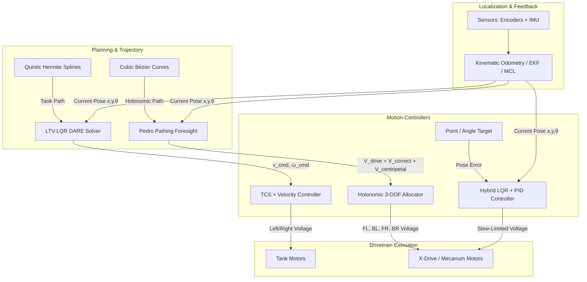

<p align="center">
  
</p>

<p align="center">
  
  
  
  
  
  
</p>

<hr>

# IRAlib — Next-Generation VEX V5 Control & Pathing Architecture

**IRAlib** is an advanced, high-performance VEX V5 robotics control framework developed at the **International Robotics Academy (Almaty, Kazakhstan)** for competitive robotics, engineered specifically for the Kazakhstan National Championship and international VEX World Championships.

Starting with version 2.2.0-Pro, **IRAlib** polymorphically supports both **Differential Tank Drive** and **Holonomic Omnidirectional Drive (X-Drive / Mecanum)**, integrating cutting-edge algorithms from **FTC Pedro Pathing (Foresight GVF)** alongside modern **LTV-LQR state-space control**, **EKF sensor fusion**, and **4-wheel kinematic odometry**.

---

## ⚡ Key Architectural Features

### 🏎️ 1. Multi-Platform Drivetrain Support (`DrivebaseType`)
- **Differential Tank Drive (`DrivebaseType::TANK`)**:
  - **LTV-LQR Trajectory Tracking**: Linear Time-Varying controller executing high-speed curved paths using an **online DARE Riccati solver** (Structure-Preserving Doubling Algorithm) on ARM Cortex-A9 at 100 Hz.
  - **TCS (Traction Control System)**: Active anti-slip module preventing tire spinout during explosive launches.
  - **Jerk-Limited Quintic Splines**: On-the-fly $C^2$-continuous 5th-order Hermite spline generator ($j \le 3.5\,\text{m/s}^3$).
  - **PIDf Inner-Loop Velocity Controller**: Hyperbolic tangent friction feedforward coupled with closed-loop PI tracking.
- **Holonomic Drive (`DrivebaseType::XDRIVE` / `MECANUM`)**:
  - **4-Wheel Kinematic Odometry**: Tracks forward $Y$ and lateral $X$ displacement directly via motor encoders without requiring external unpowered tracking wheels.
  - **Reversible Joystick Controls**: Flexible coordinate mapping with deadband filtering and active brake modes.

### 🌟 2. Pedro Pathing Subsystem (FTC Foresight C++ Port)
- **Arbitrary-Order Bézier Curves (`pedro::BezierCurve`)**:
  - Analytical evaluation of curve position $P(t)$, velocity tangent vector $P'(t)$, normal vector $\hat{N}(t)$, and curvature $\kappa(t) = \frac{x' y'' - y' x''}{(x'^2 + y'^2)^{3/2}}$.
  - **Newton-Raphson Point Projection**: Locates the exact closest parameter $t^* \in [0, 1]$ to the robot with sub-millimeter precision in under 5 iterations.
- **Guiding Vector Field (`pedro::PedroFollower`)**:
  - **Drive Vector**: Unit tangent vector scaled by optimal profiled speed.
  - **Translational Corrective Vector**: Proportional error vector ($kP_{\text{trans}} \cdot \vec{e}$) continuously pulling the robot back to the trajectory if bumped or displaced.
  - **Predictive Braking (Foresight)**: Optimal deceleration profile $v = \min(v_{\max}, \sqrt{2 \cdot a_{\max} \cdot s_{\text{rem}}})$, eliminating overshoots.
  - **Centripetal Compensation**: Feedforward acceleration $a_c = v^2 \kappa \hat{N}$ preventing outward drift on sharp turns.
- **Decoupled Heading Control (`pedro::PedroPath`)**:
  - `HeadingMode::TANGENT`: Face along the curve's direction of travel.
  - `HeadingMode::CONSTANT`: Lock a fixed heading while translating along any 2D curve.
  - `HeadingMode::FACING_POINT`: Continuously point intake/shooter toward a field coordinate while following the path.
  - `HeadingMode::LINEAR`: Smooth angular interpolation from start to finish.

### 🎯 3. Unified HYBRID Control & Anti-Throttling
- **LQR Optimal State Velocity Damping**: Replaces violent derivative spikes with smooth velocity damping ($u = k_P e - k_V v - k_A a + k_I \int e$).
- **Continuous Slew Rate Limiting**: Voltage ramp limiting (15.0 V/s) eliminates motor chattering, jitter, and thermal tripping.
- **Static Friction Feedforward ($k_S$)**: Overcomes physical drivetrain stiction seamlessly.

### 📍 4. Localization & Sensor Fusion
- **5-State Extended Kalman Filter (EKF)**: Fuses differential drive motor encoders, spring-loaded tracking wheels, and V5 Inertial Sensor (IMU) with covariance estimation.
- **Adaptive Monte Carlo Localization (AMCL)**: 2000-particle filter utilizing distance sensor raycasting against field walls for continuous 2D relocalization.
- **Multi-Sensor Recalibration Suite (`OdomReset`)**: High-precision wall bumper, optical centerline, and 4-way trigonometric distance sensor resets.

### 🛡️ 5. Safety & Diagnostic Subsystems
- **Watchdog Health Monitor (`MotorMonitor`)**: Background diagnostic task continuously verifying Smart Port cable connections and motor temperatures ($>55^\circ\text{C}$), providing haptic rumble and LCD notifications.
- **Automated Color Sorter**: Optical sensor game piece identification and automatic opposing alliance ejection with runtime color switching.

---

## 📐 System Control Flow



---

## 📂 Codebase Structure

```
include/
├── Eigen/                     # Header-only Eigen C++ template library for linear algebra
├── lemlib/                    # LemLib core foundations (Chassis, Pose, Odometry, Math)
└── subsystems/
    ├── subsystems.hpp         # Master header aggregator for all subsystems
    ├── VelocityController.hpp # PIDf inner-loop controller with Active TCS
    ├── MotorMonitor.hpp       # Real-time motor disconnect & overtemp watchdog
    ├── ColorSorter.hpp        # Optical sensor piece sorter
    ├── OdomReset.hpp          # Wall, line, and 4-distance sensor localization
    ├── pedro/                 # Pedro Pathing (FTC 2026 Foresight)
    │   ├── Point.hpp          # 2D Vector & Point algebra
    │   ├── BezierCurve.hpp    # Analytical Bézier curves, curvature, and projection
    │   ├── PedroPath.hpp      # Multi-segment path with decoupled heading
    │   └── PedroFollower.hpp  # Reactive Vector Field Follower (GVF)
    ├── ekf/
    │   └── EKF.hpp            # 5-State Extended Kalman Filter
    ├── flc/
    │   └── FuzzyLogic.hpp     # Adaptive Fuzzy Logic Controller
    ├── trajectory/
    │   └── QuinticSpline.hpp  # Jerk-limited 5th-order spline generator
    ├── ltv/
    │   ├── State.hpp          # Trajectory waypoint definition
    │   └── ltv.hpp            # LTV-LQR DARE optimal trajectory follower
    └── mcl/
        └── MCL.hpp            # AMCL particle filter localization
src/
├── main.cpp                   # Competition entrypoint with interactive test suite
└── subsystems/
    ├── VelocityController.cpp
    ├── MotorMonitor.cpp
    ├── ColorSorter.cpp
    ├── OdomReset.cpp
    ├── pedro/
    │   ├── BezierCurve.cpp    # Bézier derivatives, arc length, Newton-Raphson
    │   └── PedroFollower.cpp  # GVF vector follower with predictive braking
    ├── ekf/EKF.cpp
    ├── flc/FuzzyLogic.cpp
    ├── trajectory/QuinticSpline.cpp
    ├── ltv/ltv.cpp
    └── mcl/MCL.cpp
```

---

## 🛠️ Interactive Controller Test Suite

In driver control mode (`opcontrol`), press any button on the V5 Master Controller for instant diagnostics and calibration:

| Button | Test Name | Description / Expected Behavior |
| :--- | :--- | :--- |
| **`[ UP ]`** | **Motor Polarity Diagnostic** | Spins FL, BL, FR, BR individually for 1.2s forward, then tests holistic Forward, Strafe, and Spin. |
| **`[ A ]`** | **360° Track Width Spin** | Spins 360° in place to verify and calibrate effective track width. |
| **`[ B ]`** | **24" Linear Drive Test** | Drives forward 24 inches with HYBRID LQR+PID deceleration; reports error on LCD. |
| **`[ Y ]`** | **90° Angular Snap Turn** | Snaps heading 90° clockwise to verify angular damping and steady-state precision. |
| **`[ X ]`** | **24" Lateral Strafe Test** | Strafes 24 inches sideways using 4-wheel kinematic odometry; stops cleanly at 24". |
| **`[ LEFT ]`** | **24" Fwd + 180° Turn** | Simultaneous 3-DOF maneuver: drives forward 24" while rotating 180° smoothly. |
| **`[ DOWN ]`** | **24"x24" Hypotenuse Drive** | Drives forward 24" and strafes right 24" along a straight 45° diagonal line. |
| **`[ RIGHT ]`**| **Pedro Pathing Bézier Curve**| Drives a 24"x24" smooth S-curve using **PedroFollower (GVF + Predictive Braking)** while holding $0^\circ$ heading. |
| **`[ L1 ]`** | **Reset Odometry** | Instantly resets odometry pose coordinates to `(0, 0, 0)`. |
| **`[ R1 ]`** | **$k_S$ Characterization** | Automatically measures static friction threshold voltage required to overcome stiction. |

---

## 🎮 Driver Joysticks

- **Left Stick Y**: Inverted (Forward is Backward, Backward is Forward).
- **Left Stick X**: Lateral Strafe (Push Right = Move Right, Push Left = Move Left).
- **Right Stick X**: Turn (Reversed direction as requested).
- **Deadband**: 5-unit deadband eliminates stick drift.

---

## 🚀 Code Examples

### 1. Using Pedro Pathing for Holonomic Drivetrain (X-Drive)
```cpp
#include "main.h"
#include "lemlib/api.hpp"
#include "subsystems/subsystems.hpp"

void autonomous() {
    // 1. Enable X-Drive 4-motor kinematic odometry
    chassis.setDrivebaseType(lemlib::DrivebaseType::XDRIVE);

    // 2. Define a Cubic Bézier curve
    pedro::Point p0(0.0f, 0.0f);
    pedro::Point p1(0.0f, 24.0f * 0.65f);
    pedro::Point p2(24.0f * 0.60f, 24.0f);
    pedro::Point p3(24.0f, 24.0f);
    pedro::BezierCurve curve(p0, p1, p2, p3);

    // 3. Define path with decoupled heading (maintain 0 degrees)
    pedro::PedroPath path(curve, pedro::HeadingMode::CONSTANT, 0.0f);

    // 4. Follow with Pedro Pathing Vector Follower
    pedro::PedroFollower follower;
    follower.follow(path, 4000, 
        [](int forward, int strafe, int turn) {
            holonomicDrive(forward, strafe, turn);
        },
        []() {
            holonomicBrake();
        }
    );
}
```

### 2. Using LTV-LQR with Jerk-Limited Splines for Tank Drive
```cpp
#include "main.h"
#include "lemlib/api.hpp"
#include "subsystems/subsystems.hpp"

void autonomous() {
    // 1. Default or explicit Tank Drive mode
    chassis.setDrivebaseType(lemlib::DrivebaseType::TANK);

    // 2. Generate smooth C^2 Jerk-Limited Quintic Spline
    auto trajectory = lemlib::QuinticSplineGenerator::generateTrajectory({
        .start = lemlib::Pose(0, 0, 0),
        .end = lemlib::Pose(24.0, 48.0, 45.0),
        .maxVel = 1.2,
        .maxAccel = 2.0,
        .maxJerk = 3.5
    });

    // 3. Follow using LTV-LQR DARE optimal solver
    ltvFollower.followTrajectory(trajectory);
    ltvFollower.waitUntilDone();
}
```

---

## 🏛️ About International Robotics Academy

**International Robotics Academy (IRA)** is located in **Almaty, Kazakhstan**, educating the next generation of world-class roboticists and control engineers.

- 📍 **Location**: Almaty, Kazakhstan
- 🏆 **Focus**: Advanced Controls Theory, Embedded Systems, VEX V5 Competition Robotics

---

## 📄 License & Acknowledgments

- **License**: [MIT License](LICENSE)
- **Acknowledgments**: 
  - Thanks to [Pedro Pathing (FTC)](https://github.com/Pedro-Pathing/Pedro-Pathing) for the Foresight & GVF control foundations.
  - Thanks to [LemLib](https://github.com/LemLib/LemLib) and [Eigen](https://gitlab.com/libeigen/eigen) for core robotics foundations.
